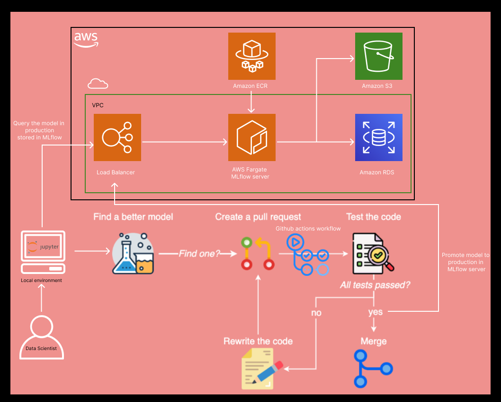
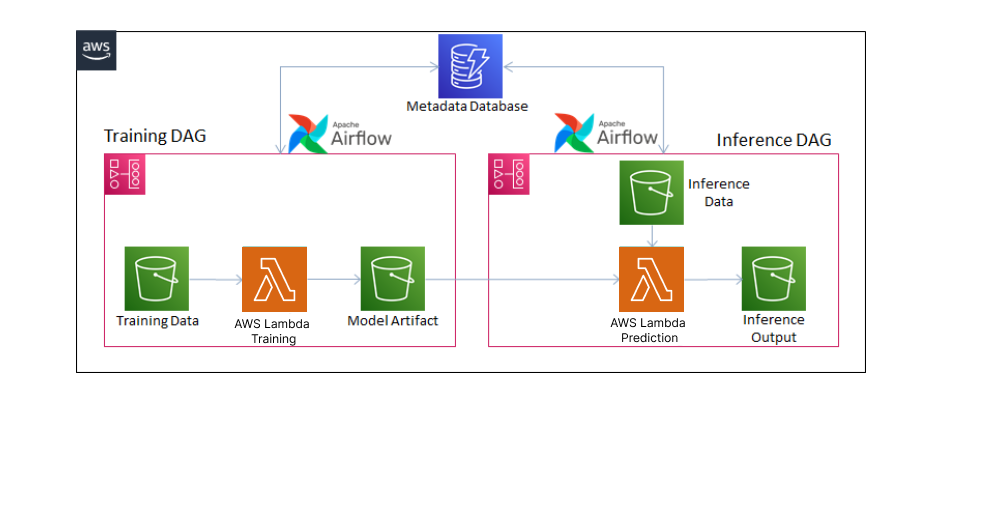

# MLOps 

This is demo of an MLOps platform. It serves the infrastructure using Pulumi and python in the proto/infra subfolder.
The stack takes a few minutes to launch the MLflow server on ECS Fargate, with an S3 bucket to store the model artifacts and a MySQL database on RDS to store track the results of experiments. The load balancer URI is output by pulumi when the MLFlow-server stack has been provisioned. This URI is used by data scientists when specifying the TRACKING_URI of the MLflow server in a local Jupyter notebook.

We can first run ds_experiments/train.py to register a model with MLflow and also promote it to production.

Then a data scientist working in a Jupyter notebook can experiment with hyperparameter tuning of the same algorithm or compare across algorithms. The can pull the model artifact from MLflow that has been labeled with "Production" and compare it with their new models just discovered.

If their new model beats the score of the model in production, then they can create a new git branch, push to Github, and submit a pull request (PR). Submitting a pull request will trigger the CI/CD pipeline using github actions workflow. 

Future steps in the CICD pipeline will eventually include:
- unit tests of various stages of pipeline (data prep, feature eng, model training, etc) using pytest
- integration test (build dockerized FASTAPI REST server) and test the outputs from a POST endpoint by CURLing
- tag new model with "Production" and store artifact
- This can be done without having to redeploy a new FastAPI container because the REST server will always pull the model artifact labeled "Production"

Note: 
- To access the MLflow server from your local Jupyter do mlflow.set_tracking_uri(<LOAD_BALANCER_URI>)
- To access the MLflow UI, just type the address of the load balancer in your web browser.

# ML Pipeline in the cloud
Currently i am implementing an Airflow DAG that will automate the data cleansing, feautre engineering, training, evaluation, and inference in AWS. This will be done by having training and inference DAGs Airflow that call lambda functions. The training DAG will output a model artifact to s3 using MLflow and the inference DAG will write prediction scores to MLflow database.

Below is a picture of the basic MLOps setup that supports both model experimentation. Next step is to deploy the production model on an ECS fargate cluster:

The picture below is the intended design for the workflow orchestration of the ML pipeline in the cloud. Currently airflow is only running locally in docker-compose and i will be testing the ability to invoke Lambda functions from this local DAG workflow.

TODO:
1. provision ML-flow in aws ECS fargate
2. run train.py to register a model and then promote it to production
3. In jupyter, do some experimentation and hyperparameter tuning to find a better model, register the model
4. pull the latest model (labeled experiment 1) and the production model 
5. Compare the scores. If the latest model beats the production model score, then we branch and submit a pull request to merge with the main branch
6. trigger github actions workflow, if the changes pass unit and integration tests we will assign the production label to the new model
7. understand how airflow can be deployed in AWS but instead of calling sagemaker jobs, call lambda functions or a REST API?
